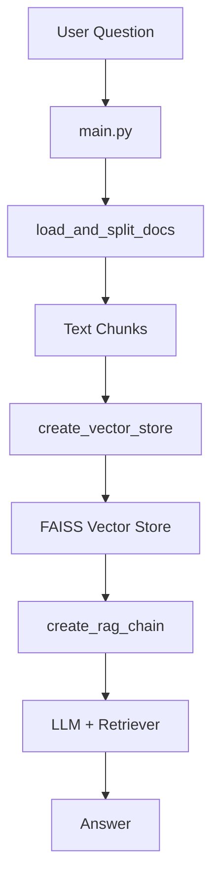
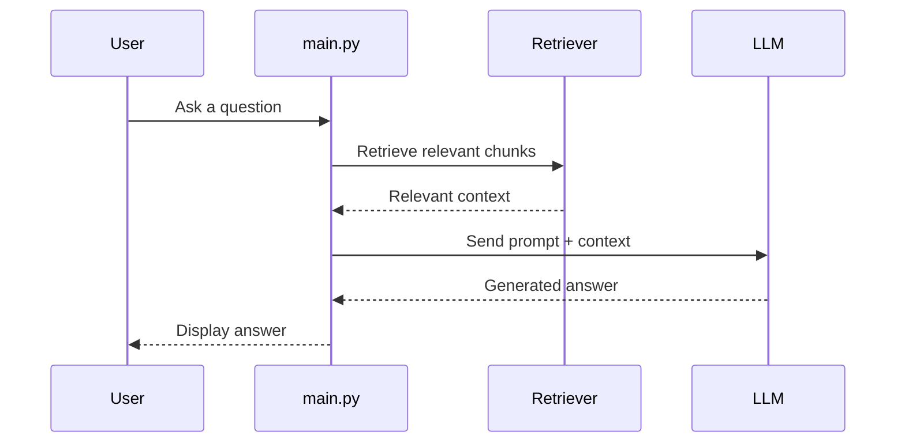

# RAG from Scratch

A small Retrieval-Augmented Generation (RAG) application that answers questions using a local text document as context. The project uses LangChain, Ollama, and FAISS to load a policy document, split it into chunks, build a vector store, and retrieve relevant context before generating an answer.

## Features

- Loads a text file from the data folder
- Splits the document into searchable chunks
- Builds a local FAISS vector store
- Retrieves the most relevant chunks for each question
- Generates answers using an Ollama-hosted LLM

## Project Structure

- app/main.py - interactive CLI entry point
- app/document_loader.py - loads and splits documents
- app/vector_store.py - creates the FAISS vector store
- app/rag_chain.py - builds the retrieval and generation flow
- data/company_policy.txt - source document used by the app



## Prerequisites

- Python 3.10+
- Ollama installed and running locally
- The following models pulled in Ollama:
  - qwen3:4b
  - nomic-embed-text

You can install and pull them with:

```bash
ollama pull qwen3:4b
ollama pull nomic-embed-text
```

## Setup

From the project root, create and activate a virtual environment:

```bash
python -m venv .venv
.venv\Scripts\activate
```

Install the dependencies:

```bash
pip install -r requirements.txt
```

## Run the Application

Start the interactive chat interface:

```bash
python app/main.py
```

Type your question at the prompt. Type exit to quit.

## How It Works

1. The app loads the text file from data/company_policy.txt.
2. The text is split into smaller chunks.
3. Each chunk is embedded and stored in a FAISS index.
4. When you ask a question, the app retrieves the most relevant chunks.
5. Those chunks are passed to the LLM along with your question to generate an answer.



## Notes

- The current implementation answers only from the provided document context.
- If the answer is not found in the retrieved chunks, it will return a fallback message.
